# 🎬 Movies REST API

[](https://nestjs.com)
[](https://www.typescriptlang.org)
[](https://www.postgresql.org)
[](https://redis.io)
[](https://www.docker.com)
[](http://localhost:8080/api/docs)

A robust, production-ready movie management REST API built with NestJS, featuring user authentication, movie discovery, watchlist management, and integration with The Movie Database (TMDB) API.

## ✨ Features

### Core Functionality
- 🎭 **Movie Management**
  - Browse and search movies from TMDB
  - Detailed movie information and metadata
  - Automatic movie data synchronization
  - Pagination and filtering support

- 👤 **User Management**
  - User registration and authentication
  - JWT-based secure authentication
  - Password hashing with bcrypt
  - Refresh token support

- 📝 **Watchlist Management**
  - Personal movie watchlists
  - Add/remove movies from watchlist
  - Watchlist sharing and management
  - User-specific movie collections

### Technical Features
- 🔒 **Security & Authentication**
  - JWT access and refresh tokens
  - Password encryption with bcrypt
  - Rate limiting with token bucket and fixed window
  - Secure API endpoints

- 🚀 **Performance & Caching**
  - Redis caching for improved performance
  - Database query optimization
  - Efficient data synchronization
  - Connection pooling

- 📚 **API Documentation**
  - Interactive Swagger UI
  - Detailed API specifications
  - Request/Response examples
  - Authentication flow documentation

- 🐳 **Deployment**
  - Docker & Docker Compose support
  - Multi-stage builds
  - Health checks
  - Production-ready configuration

## Architecture

The application follows a modular monolith architecture with clear separation of concerns. It is built with the following modules:

- **Users Module**: Handles user registration, authentication, and profile management
- **Movies Module**: Manages movie data, search, and TMDB integration
- **Watchlist Module**: Handles user watchlists and movie collections
- **Movies Provider Module**: Integrates with external movie APIs (TMDB)
- **Common Module**: Contains shared utilities, guards, interceptors, and services

### System Architecture

```mermaid
graph TB
    Client["🌐 Client Application"] --> API["🚀 NestJS API Server"]
    API --> Auth["🔐 Authentication Module"]
    API --> Movies["🎬 Movies Module"]
    API --> Watchlist["📋 Watchlist Module"]
    API --> Provider["📡 Movies Provider Module"]
    
    Auth --> DB[("🗄️ PostgreSQL")]
    Movies --> DB
    Watchlist --> DB
    
    Provider --> TMDB["🎭 TMDB API"]
    Provider --> DB
    
    API --> Redis[("⚡ Redis Cache")]
    
    subgraph "Database Tables"
        DB --> Users["👥 Users"]
        DB --> MoviesTable["🎬 Movies"]
        DB --> Genres["🏷️ Genres"]
        DB --> Ratings["⭐ Ratings"]
        DB --> WatchlistTable["📋 Watchlist"]
    end
```



### Authentication Flow


### Movie Rating Flow


### Database Design

- **Users Table**: Stores user accounts and authentication data
- **Movies Table**: Cached movie data from TMDB
- **Watchlists Table**: User watchlist collections
- **Watchlist Items Table**: Movies in user watchlists


### External Integrations

- **TMDB API**: The Movie Database for movie data
- **Redis**: Caching and session management
- **PostgreSQL**: Primary data storage

## API Endpoints

### Users
- `POST /api/users/register` - Register a new user
- `POST /api/users/login` - User login
- `POST /api/users/refresh` - Refresh access token
- `POST /api/users/logout` - User logout

### Movies
- `GET /api/movies` - Get movies with pagination and filters
- `GET /api/movies/:id` - Get movie details
- `GET /api/movies/search` - Search movies
- `POST /api/movies/:id/rate` - Rate a movie (requires authentication)
- `POST /api/movies/sync` - Sync movies from TMDB (Admin)

### Watchlists
- `GET /api/watchlists` - Get user watchlists
- `POST /api/watchlists/:id/movies` - Add movie to watchlist
- `DELETE /api/watchlists/:id/movies/:movieId` - Remove movie from watchlist

## Getting Started

### 📋 Prerequisites

#### Required Software
- Node.js (v18 or later)
- npm (v9 or later)
- Docker (latest version)
- Docker Compose

#### Recommended VS Code Extensions
- ESLint
- Prettier
- Docker
- REST Client
- Postman

### 🚀 Installation

#### Local Development Setup

1. Clone the repository
```powershell
git clone https://github.com/your-username/movies-restapi.git
cd Movies_RESTAPI
```

2. Install dependencies
```powershell
npm install
```

3. Set up environment variables
```powershell
Copy-Item .env.example .env
# Edit .env with your configuration
```

4. Start services with Docker
```powershell
docker-compose up
```

5. Run database migrations
```powershell
npm run migration:run
```

6. Start the application in development mode
```powershell
npm run start:dev
```

The application will be available at:
- API: [http://localhost:8080](http://localhost:8080)
- Swagger UI: [http://localhost:8080/api/docs](http://localhost:8080/api/docs)

#### Development Tools

- Enable watch mode for automatic rebuilds:
```powershell
npm run start:debug
```

- Run linting:
```powershell
npm run lint
```

- Run formatting:
```powershell
npm run format
```

#### Environment Variables

| Variable | Description | Default |
|----------|-------------|--------|
| `PORT` | Application port | 8080 |
| `NODE_ENV` | Environment | development |
| `DATABASE_HOST` | PostgreSQL host | localhost |
| `DATABASE_PORT` | PostgreSQL port | 5432 |
| `DATABASE_USER` | Database username | postgres |
| `DATABASE_PASSWORD` | Database password | - |
| `DATABASE_NAME` | Database name | movies |
| `REDIS_HOST` | Redis host | localhost |
| `REDIS_PORT` | Redis port | 6379 |
| `REDIS_PASSWORD` | Redis password | - |
| `REDIS_TTL_MS` | Redis TTL in milliseconds | 60000 |
| `JWT_SECRET` | JWT secret key | - |
| `JWT_REFRESH_SECRET` | JWT refresh secret | - |
| `JWT_ACCESS_TOKEN_EXPIRATION` | Access token expiration | 15m |
| `JWT_REFRESH_TOKEN_EXPIRATION` | Refresh token expiration | 7d |
| `BCRYPT_SALT_ROUNDS` | Password hashing rounds | 10 |
| `TMDB_API_URL` | TMDB API base URL | https://api.themoviedb.org/3 |
| `TMDB_API_KEY` | TMDB API key | - |
| `TMDB_MAX_PAGES` | Max pages to sync | 10 |
| `TOKEN_BUCKET_CAPACITY` | Rate limit bucket capacity | 20 |
| `TOKEN_BUCKET_REFILL_RATE` | Rate limit refill rate | 2 |
| `FIXED_WINDOW_SIZE_MS` | Fixed window size | 60000 |
| `FIXED_WINDOW_MAX_REQUESTS` | Max requests per window | 100 |

### 🐳 Running with Docker

The application is fully dockerized and can be run with a single command:

1. Build and start all services:
```powershell
docker-compose up --build -d
```

2. Check service status:
```powershell
docker-compose ps
```

3. View logs in real-time:
```powershell
docker-compose logs -f movies-api
```

4. Stop all services:
```powershell
docker-compose down
```

To reset everything and start fresh:
```powershell
docker-compose down -v
docker-compose up --build -d
```

### 📚 API Documentation

The API documentation is available through Swagger UI:

1. Start the application (if not already running)
2. Visit [http://localhost:8080/api/docs](http://localhost:8080/api/docs)
3. Features available in Swagger UI:
   - Interactive API testing
   - Request/Response examples
   - Model schemas
   - Authentication setup

You can also export the OpenAPI specification:
```powershell
curl http://localhost:8080/api-json > openapi.json
```

## 🧪 Testing

### Unit Tests
Run unit tests:
```powershell
npm test
```

Watch mode for development:
```powershell
npm run test:watch
```

### E2E Tests
Run end-to-end tests:
```powershell
npm run test:e2e
```

## 📁 Project Structure

```
Movies_RESTAPI/
├── src/
│   ├── common/                 # Shared utilities and services
│   │   ├── dto/               # Common DTOs
│   │   ├── filters/           # Exception filters
│   │   ├── guards/            # Authentication guards
│   │   ├── interceptors/      # Request/Response interceptors
│   │   ├── middlewares/       # Custom middlewares
│   │   └── services/          # Shared services (logger, etc.)
│   ├── config/                # Configuration files
│   │   ├── app.config.ts      # Application configuration
│   │   ├── env.validation.ts  # Environment validation
│   │   └── typeorm.config.ts  # Database configuration
│   ├── database/              # Database related files
│   │   └── migrations/        # TypeORM migrations
│   ├── movies/                # Movies module
│   │   ├── controllers/       # Movie controllers
│   │   ├── dto/              # Movie DTOs
│   │   ├── entities/         # Movie entities (Movie, Genre, Rating)
│   │   ├── services/         # Movie business logic
│   │   └── views/            # Database views
│   ├── movies-provider/       # External movie data provider
│   │   ├── controllers/       # Sync controllers
│   │   ├── interfaces/        # Provider interfaces
│   │   ├── providers/         # TMDB API provider
│   │   └── services/          # Sync services
│   ├── users/                 # Users module
│   │   ├── controllers/       # User controllers
│   │   ├── dto/              # User DTOs
│   │   ├── entities/         # User entity
│   │   ├── services/         # User services
│   │   └── strategies/       # Authentication strategies
│   ├── watchlist/            # Watchlist module
│   │   ├── controllers/       # Watchlist controllers
│   │   ├── dto/              # Watchlist DTOs
│   │   ├── entities/         # Watchlist entity
│   │   ├── services/         # Watchlist services
│   │   └── views/            # Watchlist views
│   ├── app.module.ts         # Root application module
│   └── main.ts               # Application entry point
├── test/                     # E2E tests
├── init-db/                  # Database initialization scripts
├── docker-compose.yml        # Docker services configuration
├── Dockerfile               # Application container
└── package.json             # Dependencies and scripts
```

## 🚀 Future Enhancements

### Planned Features
- **🎬 Advanced Movie Features**
  - Movie recommendations based on user ratings and preferences
  - Movie reviews and comments system
  - Movie trailers and media gallery
  - Advanced filtering (by year, rating, popularity)
  - Movie collections and series support

- **👥 Social Features**
  - User profiles and public watchlists
  - Follow other users and see their activity
  - Movie discussion forums
  - Social sharing of ratings and watchlists

- **📊 Analytics & Insights**
  - User viewing statistics and insights
  - Popular movies dashboard
  - Rating trends and analytics
  - Personalized movie discovery

- **🔧 Technical Improvements**
  - GraphQL API support
  - Real-time notifications with WebSockets
  - Advanced caching strategies
  - Database query optimization
  - Microservices architecture migration

- **📱 Platform Expansion**
  - Mobile app development (React Native)
  - Progressive Web App (PWA) features
  - Desktop application
  - Browser extensions

- **🛡️ Security & Performance**
  - OAuth2 integration (Google, Facebook)
  - Two-factor authentication (2FA)
  - Advanced rate limiting per user
  - CDN integration for media files
  - Horizontal scaling support

### Contributing
We welcome contributions! Please see our contributing guidelines for more information on how to get involved in these future enhancements.

### Test Coverage
Generate coverage report:
```powershell
npm run test:cov
```

View the detailed coverage report at `coverage/lcov-report/index.html`

### Continuous Testing
For development with continuous testing:
```powershell
npm run test:watch -- path/to/specific.spec.ts
```

## 🏗️ Design Decisions

### Modular Monolith

The application is designed as a modular monolith to balance development speed with future scalability. Each module is self-contained with its own controllers, services, and entities, making it easy to extract into microservices later.

### Authentication Strategy

The application uses JWT-based authentication with both access and refresh tokens. This provides a good balance between security and user experience, allowing for secure API access while maintaining session persistence.

### Caching Strategy

Redis is used for caching frequently accessed data, particularly movie information from TMDB. This reduces external API calls and improves response times.

### Rate Limiting

The application implements both token bucket and fixed window rate limiting strategies to protect against abuse and ensure fair usage of the API.

### Database Migrations

TypeORM migrations are used to manage database schema changes, ensuring consistent database state across different environments.

## 🚀 Deployment

### Production Considerations

1. **Environment Variables**: Ensure all sensitive environment variables are properly set
2. **Database**: Use a managed PostgreSQL service for production
3. **Redis**: Use a managed Redis service for production
4. **Monitoring**: Implement proper logging and monitoring
5. **SSL/TLS**: Enable HTTPS in production
6. **Rate Limiting**: Adjust rate limiting based on expected traffic

### Docker Production Build

```powershell
docker build -t movies-api:latest .
docker run -p 8080:8080 --env-file .env.production movies-api:latest
```

## 🤝 Contributing

1. Fork the repository
2. Create a feature branch
3. Make your changes
4. Add tests for new functionality
5. Ensure all tests pass
6. Submit a pull request