# Movies Provider Module

This module provides a unified interface for fetching movie data from external sources and synchronizing it with the local database. TMDB (The Movie Database) is integrated as the default and primary provider.

## Overview

The Movies Provider module serves as an abstraction layer between external movie data sources and the application's database. It handles:

- **Data Fetching**: Retrieving movie and genre data from external APIs
- **Database Synchronization**: Syncing external data with local PostgreSQL database
- **Provider Management**: Supporting multiple data providers with a unified interface
- **Data Transformation**: Converting external API responses to internal data models

## Architecture

```mermaid
graph TB
    SyncController["🔄 Sync Controller"] --> DatabaseSyncService["📊 Database Sync Service"]
    DatabaseSyncService --> MoviesProviderService["🎬 Movies Provider Service"]
    MoviesProviderService --> TmdbProvider["🎭 TMDB Provider"]
    TmdbProvider --> TmdbClient["📡 TMDB Client Service"]
    TmdbClient --> TMDBAPI["🌐 TMDB API"]
    
    DatabaseSyncService --> MovieEntity["🎬 Movie Entity"]
    DatabaseSyncService --> GenreEntity["🏷️ Genre Entity"]
    
    subgraph "Database"
        MovieEntity --> PostgreSQL[("🗄️ PostgreSQL")]
        GenreEntity --> PostgreSQL
    end
    
    subgraph "External APIs"
        TMDBAPI
    end
```



### Core Components

- **MovieProviderInterface**: Core interface that all movie providers must implement
- **MoviesProviderService**: Service that manages movie data access using configured providers
- **DatabaseSyncService**: Handles synchronization between external providers and local database
- **SyncController**: REST API endpoints for triggering data synchronization

### TMDB Integration

The TMDB provider is fully integrated within this module:

- **Models** (`providers/tmdb/models/`): 
  - `Genre`: Movie genre definition
  - `Movie`: Movie entity with all properties
  - `MoviesClientList`: Paginated movie list response
- **Interfaces** (`providers/tmdb/interfaces/`):
  - `TmdbClientInterface`: Contract for TMDB API client
  - `TmdbApiResponses`: TMDB API response type definitions
- **Services** (`providers/tmdb/services/`):
  - `TmdbClientService`: Handles direct communication with TMDB API
- **Provider** (`providers/`):
  - `TmdbProvider`: Implements MovieProviderInterface using TmdbClientService

## API Endpoints

### Data Synchronization

```http
POST /api/sync/genres
```
Synchronizes movie genres from TMDB to the local database.

**Response:**
```json
{
  "success": true,
  "message": "Successfully synced 19 new genres",
  "data": {
    "newGenres": 19
  }
}
```

```http
POST /api/sync/movies
```
Synchronizes movies from TMDB to the local database with pagination support.

**Response:**
```json
{
  "success": true,
  "message": "Successfully synced 150 new movies",
  "data": {
    "newMovies": 150,
    "totalProcessed": 200
  }
}
```

```http
POST /api/sync/all
```
Synchronizes both genres and movies in sequence.

**Response:**
```json
{
  "success": true,
  "message": "Successfully synced all data",
  "data": {
    "newGenres": 5,
    "newMovies": 75,
    "totalProcessed": 100
  }
}
```

## Configuration

The module requires the following environment variables:

| Variable | Description | Default | Required |
|----------|-------------|---------|----------|
| `TMDB_API_URL` | TMDB API base URL | `https://api.themoviedb.org/3` | Yes |
| `TMDB_API_KEY` | TMDB API authentication key | - | Yes |
| `TMDB_MAX_PAGES` | Maximum pages to sync during movie synchronization | `10` | No |

**Example configuration:**
```env
TMDB_API_URL=https://api.themoviedb.org/3
TMDB_API_KEY=your_api_key_here
TMDB_MAX_PAGES=20
```

## Synchronization Process

### Genre Synchronization
1. Fetches all genres from TMDB API
2. Compares with existing genres in database
3. Inserts only new genres to avoid duplicates
4. Returns sync statistics

### Movie Synchronization
1. Fetches movies page by page from TMDB API (up to `TMDB_MAX_PAGES`)
2. Filters out movies that already exist (by `tmdbId`)
3. Validates movie data (requires title and tmdbId)
4. Maps genre relationships using existing genre entities
5. Saves movies with their genre associations
6. Handles errors gracefully and continues processing

### Error Handling
- Network timeouts: Automatic retry with 2-second delay
- Duplicate data: Skipped automatically
- Invalid data: Logged and skipped
- API rate limits: Handled with delays between requests

## Module Structure

```
movies-provider/
├── controllers/
│   ├── sync.controller.ts              # Sync API endpoints
│   └── sync.controller.spec.ts         # Controller tests
├── interfaces/
│   └── movie-provider.interface.ts     # Provider contract
├── providers/
│   ├── tmdb.provider.ts                # TMDB provider implementation
│   ├── tmdb.provider.spec.ts           # Provider tests
│   └── tmdb/
│       ├── models/
│       │   ├── genre.model.ts          # Genre data model
│       │   ├── movie.model.ts          # Movie data model
│       │   └── movies-client-list.model.ts # Paginated response model
│       ├── interfaces/
│       │   ├── tmdb-api-responses.interface.ts # API response types
│       │   └── tmdb-client.interface.ts # Client contract
│       └── services/
│           └── tmdb-client.service.ts  # TMDB API client
├── services/
│   ├── database-sync.service.ts        # Database synchronization logic
│   ├── database-sync.service.spec.ts   # Sync service tests
│   ├── movies-provider.service.ts      # Provider management service
│   └── movies-provider.service.spec.ts # Provider service tests
├── movies-provider.module.ts           # Module definition
└── README.md                           # This documentation
```

## Usage Examples

### Programmatic Usage

```typescript
import { MoviesProviderService } from './services/movies-provider.service';
import { DatabaseSyncService } from './services/database-sync.service';

// Inject services in your component/service
constructor(
  private readonly moviesProviderService: MoviesProviderService,
  private readonly databaseSyncService: DatabaseSyncService,
) {}

// Fetch genres from external provider
const genres = await this.moviesProviderService.getGenres();

// Fetch movies with pagination
const moviesPage1 = await this.moviesProviderService.getMovies(1);
const moviesPage2 = await this.moviesProviderService.getMovies(2);

// Sync data to database
const genresSyncResult = await this.databaseSyncService.syncGenres();
const moviesSyncResult = await this.databaseSyncService.syncMovies();
const allSyncResult = await this.databaseSyncService.syncAll();
```

### API Usage

```bash
# Sync genres
curl -X POST http://localhost:8080/api/sync/genres \
  -H "Authorization: Bearer YOUR_JWT_TOKEN"

# Sync movies
curl -X POST http://localhost:8080/api/sync/movies \
  -H "Authorization: Bearer YOUR_JWT_TOKEN"

# Sync all data
curl -X POST http://localhost:8080/api/sync/all \
  -H "Authorization: Bearer YOUR_JWT_TOKEN"
```

## Adding New Providers

While TMDB is the integrated default provider, the architecture supports adding additional providers:

### Step-by-Step Guide

1. **Create Provider Structure**
```
providers/
└── netflix/
    ├── models/
    │   ├── genre.model.ts
    │   ├── movie.model.ts
    │   └── movies-client-list.model.ts
    ├── interfaces/
    │   ├── netflix-api-responses.interface.ts
    │   └── netflix-client.interface.ts
    ├── services/
    │   └── netflix-client.service.ts
    └── netflix.provider.ts
```

2. **Implement Provider Interface**
```typescript
@Injectable()
export class NetflixProvider implements MovieProviderInterface {
  constructor(private readonly netflixClient: NetflixClientService) {}

  getProviderName(): string {
    return 'netflix';
  }

  async getGenres(): Promise<Genre[]> {
    const response = await this.netflixClient.getGenres();
    return response.map(genre => ({
      id: genre.id,
      name: genre.name
    }));
  }

  async getMovies(page: number = 1): Promise<MoviesClientList> {
    const response = await this.netflixClient.getMovies(page);
    return {
      movies: response.results.map(movie => ({
        tmdbId: movie.id,
        title: movie.title,
        overview: movie.overview,
        // ... map other fields
      })),
      currentPage: response.page,
      totalPages: response.total_pages
    };
  }
}
```

3. **Register in Module**
```typescript
@Module({
  providers: [
    // ... existing providers
    NetflixProvider,
    NetflixClientService,
    {
      provide: 'MOVIE_PROVIDERS',
      useFactory: (tmdb: TmdbProvider, netflix: NetflixProvider) => [
        tmdb, 
        netflix
      ],
      inject: [TmdbProvider, NetflixProvider],
    },
  ],
})
export class MoviesProviderModule {}
```

4. **Use Specific Provider**
```typescript
// Use specific provider
const netflixGenres = await this.moviesProviderService.getGenres('netflix');
const netflixMovies = await this.moviesProviderService.getMovies(1, 'netflix');
```

### Provider Interface Contract

```typescript
export interface MovieProviderInterface {
  /**
   * Returns the unique name identifier for this provider
   */
  getProviderName(): string;

  /**
   * Fetches movie genres from the provider
   */
  getGenres(): Promise<Genre[]>;

  /**
   * Fetches movies with pagination support
   * @param page Page number (1-based)
   */
  getMovies(page?: number): Promise<MoviesClientList>;
}
```

**Note:** TMDB will remain the default provider even when additional providers are added. The system will fall back to TMDB if no specific provider is requested.

## Testing

The module includes comprehensive test coverage:

```bash
# Run all tests
npm test

# Run specific test files
npm test -- sync.controller.spec.ts
npm test -- database-sync.service.spec.ts
npm test -- movies-provider.service.spec.ts
npm test -- tmdb.provider.spec.ts

# Run tests with coverage
npm run test:cov
```

## Troubleshooting

### Common Issues

1. **TMDB API Key Issues**
   - Ensure `TMDB_API_KEY` is set correctly
   - Verify API key has proper permissions
   - Check API key quotas and limits

2. **Database Connection Issues**
   - Verify PostgreSQL connection settings
   - Ensure database migrations are run
   - Check entity relationships are properly configured

3. **Sync Performance Issues**
   - Adjust `TMDB_MAX_PAGES` for smaller batches
   - Monitor database connection pool settings
   - Consider running sync operations during off-peak hours

4. **Memory Issues During Large Syncs**
   - Reduce `TMDB_MAX_PAGES` value
   - Implement batch processing for large datasets
   - Monitor application memory usage

### Debug Logging

Enable debug logging to troubleshoot sync issues:

```env
LOG_LEVEL=debug
```

This will provide detailed information about:
- API requests and responses
- Database operations
- Error details and stack traces
- Performance metrics